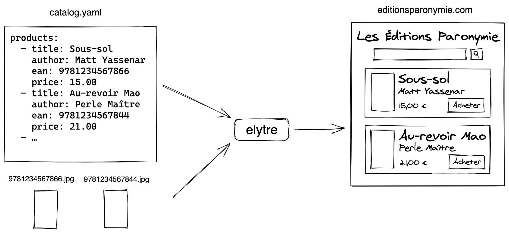

# elytre

[](https://www.npmjs.com/package/elytre)
[](https://github.com/elytre/elytre/actions?query=workflow%3ACI)

Elytre is a tool to build a serverless online bookstore with a search engine
from a catalog file.

<a href="build-process.png">
  
</a>

⚠ Elytre is still in early development and it would be unwise to use it in
production at that stage. Expect breaking changes, strange bugs, broken tests
and missing documentation until 1.0 is released (hopefully in november 2020).

## Install

Requirements:

- Node v12.18+
- Yarn

1. Create an empty directory for your project
2. Initialize yarn: `yarn init`
3. Add Elytre: `yarn add --exact elytre`
4. Add both `start` and `build` scripts to your package.json:

```json
{
  "scripts": {
    "start": "elytre start",
    "build": "elytre build"
  }
}
```

## Usage

For your elytre site to be built successfully, your project directory will
require at least three files:

- a `site.yaml` file specifying your site's info and configuration (see
  [Site config file specification](#site-config-file-specification) below)
- a `catalog.yaml` file describing your books catalog (see
  [Catalog file specification](#catalog-file-specification) below).
- a `styles.css` stylesheet to customize your site's appearance (see
  [Stylesheet file specification](#stylesheet-file-specification) below).

Optionnaly, you can add cover images in a `covers` folder in your project's
directory. Image file names must match the following pattern: `{ean}.jpg` (e.g.
`9781234567890.jpg`), and each ean in an image file name must match the ean of a
product described in the catalog.

### Site config file specification

Customize your site's configuration by adding a `site.yaml` file in your
project's directory.

```yaml
# The site's title, as displayed in site's header and browser's tab
title: Les Éditions Paronymie
# The site menus
menus:
  # Menu's slot can be header, nav or footer
  header:
  footer: …
  nav:
    # Menu contains a list of entries with a label (text) and a link (url)
    - label: About
      link: /pages/about
    - label: contact
      link: /contact/
```

### Catalog file specification

Customize your products catalog by adding a `catalog.yaml` file in your
project's directory.

```yaml
products:
  - ean: 9781234567890
    title: Chaussons d'ours
    author: Laetitia Mani
  - ean: 9781234567811
    title: Sous-sol
    author: Matt Yassenar
```

### Stylesheet file specification

Customize your site's appearance by adding a `styles.css` file in your project's
directory.

```css
.ElytreSite {
  /* This is a global wrapper for all your site. Here you can set page width,
  margins, etc. */
}

.Header {
  /* How the site header is displayed */
}

.Header .Menu {
  /* How the header is displayed */
}

.Header .Menu .Menu-entry {
  /* How a single entry is displayed in the header menu */
}

.Product {
  /* How a product is displayed */
}

.Product .Product-cover-image {
  /* How a product cover image is displayed */
}

.Product .Product-infos {
  /* How a product's infos (title, author, ean) are displayed */
}

.Product .Product-title {
  /* How a product's title is displayed */
}

.ProductList {
  /* How a list of products is displayed */
}

.ProductList .Product {
  /* How a product is displayed when in a list of products */
}

.HomePage .ProductList .Product {
  /* How a product appears when in a list on home page */
}

.ProductPage .Product {
  /* How a product is displayed when on a single product page */
}

.Error404Page .Error404Page-title {
  /* How a title appears on a 404 error page */
}

.Error404Page .Error404Page-reason {
  /* How the reasons appears if provided on a 404 error page */
}

.Footer {
  /* How the site footer is displayed */
}

.Footer-powered-by {
  /* The "Powered by Elytre" text in the footer can be hidden (please don't!)
  or made more discreet here */
}
```

### Once you've created these files, you can:

#### Build your elytre site for production

```console
$ yarn build
```

This will build your website for production in a `build` folder, ready for
deployment. You can serve this folder using any web server or static website
host.

#### Start elytre in development mode:

```console
$ yarn start
```

This will spin a local webserver for development on. Open http://localhost:1854/
to view it in your browser. The page will reload automatically if you edit files
in your project's directory.

## Tests

Lint code inside this repository with:

```console
$ yarn lint
```

Run tests inside this repository with:

```console
$ yarn test
```

## Development

Elytre is made of two main parts:

- `template/src`: a template React site that is merged with user's customization
  files to build the final elytre site
- `build/src`: a node tool that builds the final elytre site using the React
  template and user's customization file

Both are written in Typescript and needs to be transpiled before it can be used.

```console
$ yarn build
```

Files are linted, tested and transpiled before the package is published to npm.

During development, template files can be watched and transpiled as they are
changed:

```console
$ yarn dev
```
